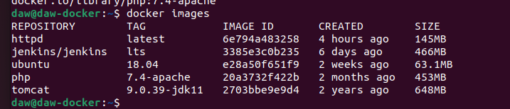

# Practica Docker 2


[TOC]


### 1. Descarga las siguientes imágenes: ubuntu:18.04 , httpd , tomcat:9.0.39-jdk11 , jenkins/jenkins:lts , php:7.4-apache . 

```bash
daw@daw-docker:~$ docker pull ubuntu:18.04
daw@daw-docker:~$ docker pull php:7.4-apache
daw@daw-docker:~$ docker pull jenkins/jenkins:lts
daw@daw-docker:~$ docker pull tomcat:9.0.39-jdk11
daw@daw-docker:~$ docker pull httpd
```

### 2. Muestras las imágenes que tienes descargadas. 



### 3. Crea un contenedor demonio con la imagen php:7.4-apache 

```bash
daw@daw-docker:~$ docker run -d --name Demonphp php:7.4-apache
```


### 4. Comprueba el tamaño del contenedor en el disco duro. 

### 5. Con la instrucción docker cp podemos copiar ficheros a o desde un contenedor. Puedes encontrar información es esta página. 

#### a)Crea un fichero en tu ordenador, con el siguiente contenido: 

```php
<?php
echo phpinfo();
?>
```


#### b)Copia un fichero info.php al directorio /var/www/html del contenedor con docker cp . 

### 6. Vuelve a comprobar el espacio ocupado por el contenedor. 


### 7.Accede al fichero info.php desde un navegador web