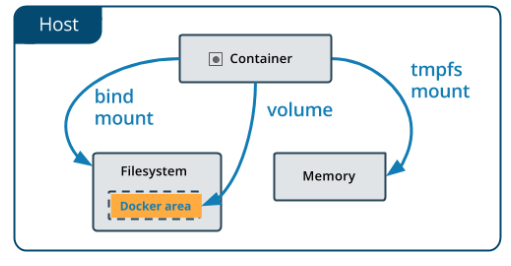

# Practica 3 Volúmenes Docker

[TOC]

## Vamos a trabajar con volúmenes docker:

###  1. Crea un volumen docker que se llame miweb.2.

###  2.Crea un contenedor desde la imagen php:7.4-apache donde montes en el directorio/var/www/html (que sabemos que es el DocumentRoot del servidor que nos ofrece esaimagen) el volumen docker que has creado.

###  3. Utiliza el comando docker cp para copiar un fichero index.html en el directorio/var/www/html.4. 

### 4. Accede al contenedor desde el navegador para ver la información ofrecida por el ficheroindex.html. 

### 5. Borra el contenedor.

### 6. Crea un nuevo contenedor y monta el mismo volumen como en el ejercicio anterior.

### 7. Accede al contenedor desde el navegador para ver la información ofrecida por el ficheroindex.html. ¿Seguía existiendo ese fichero?

## Vamos a trabajar con bind mount:

### 1. Crea un directorio en tu host y dentro crea un fichero index.html.2. 

### 2. Crea un contenedor desde la imagen php:7.4-apache donde montes en el directorio/var/www/html el directorio que has creado por medio de bind mount.3. 

### 3. Accede al contenedor desde el navegador para ver la información ofrecida por el ficheroindex.html.4. 

### 4. Modifica el contenido del fichero index.html en tu host y comprueba que al refrescar lapágina ofrecida por el contenedor, el contenido ha cambiado.5. 

### 5. Borra el contenedor6. Crea un nuevo contenedor y monta el mismo directorio como en el ejercicio anterior.7. 

### 6. Accede al contenedor desde el navegador para ver la información ofrecida por el ficheroindex.html. ¿Se sigue viendo el mismo contenido?