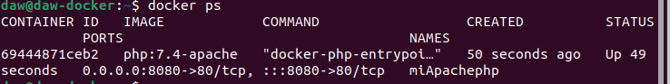
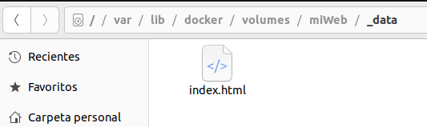
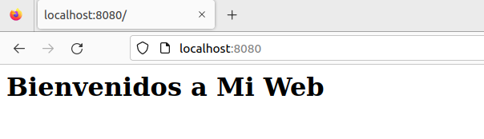
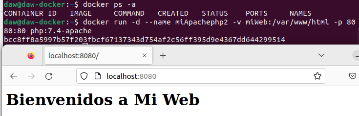
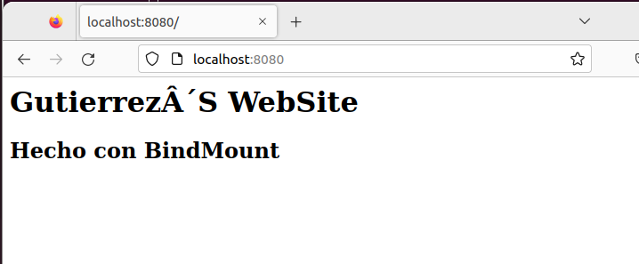
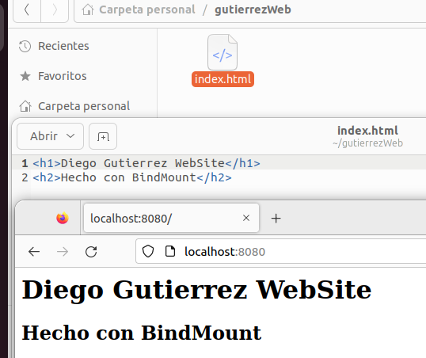
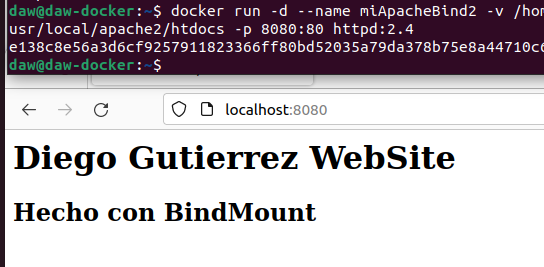

# Practica 3 Volúmenes Docker


[TOC]

## Vamos a trabajar con volúmenes docker:

###  1. Crea un volumen docker que se llame miweb.

```bash
daw@daw-docker:~$ docker volume create miWeb

miWeb
```

###  2.Crea un contenedor desde la imagen php:7.4-apache donde montes en el directorio/var/www/html (que sabemos que es el DocumentRoot del servidor que nos ofrece esaimagen) el volumen docker que has creado.

```bash
daw@daw-docker:~$ docker run -d --name miApachephp -v miWeb:/var/www/html -p 8080:80 php:7.4-apache
```



###  3. Utiliza el comando docker cp para copiar un fichero index.html en el directorio/var/www/html. 

```bash
daw@daw-docker:~$ docker cp index.html miApachephp:/var/www/html
```



### 4. Accede al contenedor desde el navegador para ver la información ofrecida por el ficheroindex.html. 



### 5. Borra el contenedor.

```bash
daw@daw-docker:~$ docker rm -f miApachephp 
miApachephp
daw@daw-docker:~$ docker ps -a
CONTAINER ID   IMAGE     COMMAND   CREATED   STATUS    PORTS     NAMES

```

### 6. Crea un nuevo contenedor y monta el mismo volumen como en el ejercicio anterior.

```bash
daw@daw-docker:~$ docker run -d --name miApachephp2 -v miWeb:/var/www/html -p 8080:80 php:7.4-apache
bcc8ff8a5997b57f203fbcf67137343d754af2c56ff395d9e4367dd644299514

```

### 7. Accede al contenedor desde el navegador para ver la información ofrecida por el ficheroindex.html. ¿Seguía existiendo ese fichero?



Comprobamos que sigue existiendo el index.html ya que los volumenes convervan los datos y hemos montado el contenedor con el volumen miWeb.

## Vamos a trabajar con bind mount:

### 1. Crea un directorio en tu host y dentro crea un fichero index.html. 

```bash
daw@daw-docker:~$ mkdir gutierrezWeb
daw@daw-docker:~$ cd gutierrezWeb/
daw@daw-docker:~/gutierrezWeb$ nano index.html
daw@daw-docker:~/gutierrezWeb$ 

```

### 2. Crea un contenedor desde la imagen php:7.4-apache donde montes en el directorio/var/www/html el directorio que has creado por medio de bind mount.

```bash
daw@daw-docker:~$ docker run -d --name miApacheBind -v /home/daw/gutierrezWeb:/usr/local/apache2/htdocs -p 8080:80 httpd:2.4

```

### 3. Accede al contenedor desde el navegador para ver la información ofrecida por el ficheroindex.html.

###  

### 4. Modifica el contenido del fichero index.html en tu host y comprueba que al refrescar lapágina ofrecida por el contenedor, el contenido ha cambiado. 



### 5. Borra el contenedor.

```bash
daw@daw-docker:~$ docker rm -f miApacheBind 
miApacheBind

```

### 6. Crea un nuevo contenedor y monta el mismo directorio como en el ejercicio anterior. 

```bash
daw@daw-docker:~$ docker run -d --name miApacheBind2 -v /home/daw/gutierrezWeb:/usr/local/apache2/htdocs -p 8080:80 httpd:2.4

```

### 6. Accede al contenedor desde el navegador para ver la información ofrecida por el ficheroindex.html. ¿Se sigue viendo el mismo contenido?.



Sigue mostrando el mismo contenido, porque seguimos teniendo la ruta con el index.html en el equipo y hemos montando el contenedor con BindMount.