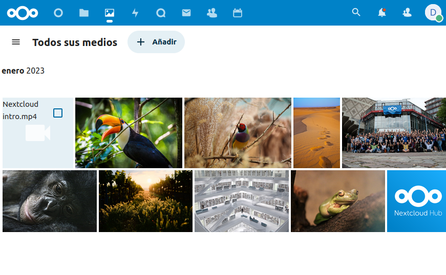

# 4 - Redes en Docker - ejercicios

## Trabajar con redes docker

[TOC]


### 1.Vamos a crear dos redes de ese tipo (BRIDGE) con los siguientes datos:

1. Red1


- Nombre: red1

- Dirección de red: 172.28.0.0

- Máscara de red: 255.255.0.0

- Gateway: 172.28.0.1

```bash
daw@daw-docker: ~$docker network create -d bridge --subnet=172.28.0/16 --gateway=172.28.0.1 red1
```

​			2.Red2

- Nombre: red2

- Es resto de los datos será proporcionados automáticamente por Docker.

```bash
daw@daw-docker:~$ docker network create red2
```


### 2.Poner en ejecución un contenedor de la imagen ubuntu:20.04 que tenga como hostnamehost1 , como IP 172.28.0.10 y que esté conectado a la red1. Lo llamaremos u1.

```bash
daw@daw-docker:~$ docker run -it --name u1 --network red1 --ip 172.28.0.10 --hostname host1 ubuntu:20.04
```

### 3. Entrar en ese contenedor e instalar la aplicación ping ( apt update && apt install inetutils-ping ).

```bash
root@host1:/# apt update
root@host1:/# apt install inetutils-ping 
```

### 4. Poner en ejecución un contenedor de la imagen ubuntu:20.04 que tenga como hostname host2 y que esté conectado a la red2. En este caso será docker el que le de una IP correspondiente a esa red. Lo llamaremos u2 .

```bash
daw@daw-docker:~$ docker run -it --name u2 --network red2 --hostname host2 ubuntu:20.04
```

### 5. Entrar en ese contenedor e instalar la aplicación ping ( apt update && apt install inetutils-ping ).

```bash
root@host1:/# apt update
root@host1:/# apt install inetutils-ping 
```

### 6.Pantallazo donde se vea la configuración de red del contenedor u1.


### 7.Pantallazo donde se vea la configuración de red del contenedor u2.


### 8.Pantallazo donde desde cualquiera de los dos contenedores se pueda ver que no podemos hacer ping al otro ni por ip ni por nombre.


### 9.Pantallazo donde se pueda comprobar que si conectamos el contenedor u1 a la red2 (con docker network connect ), desde el contenedor u1, tenemos acceso al contenedor u2 mediante ping, tanto por nombre como por ip.

```bash
daw@daw-docker:~$ docker network connect red2 u1
```


## Despliegue de Nextcloud + mariadb

### 1.Crea una red de tipo bridge.

```bash
daw@daw-docker:~$ docker network create redMariaNext
```

### 2. Crea el contenedor de la base de datos conectado a la red que has creado. La base de datos se debe configurar para crear una base de dato y un usuario. Además el contenedor debe utilizar almacenamiento (volúmenes o bind mount) para guardar la información. Puedes seguir la documentación de [mariadb](https://hub.docker.com/_/mariadb)[ ](https://hub.docker.com/_/mariadb)o la de [PostgreSQL](https://hub.docker.com/_/postgres)[ ](https://hub.docker.com/_/postgres).

```bash
daw@daw-docker:~$ docker run -d --name miMariadb 
--network redMariaNext 
-v /opt/mysql_base1:/var/lib/mysql
-e MYSQL_DATABASE=base1
-e MYSQL_USER=usuario1
-e MYSQL_PASSWORD=diego
-e MYSQL_ROOT_PASSWORD=diego
mariadb:10.5
```

### 3. A continuación, siguiendo la documentación de la imagen [nextcloud](https://hub.docker.com/_/nextcloud)[ ](https://hub.docker.com/_/nextcloud), crea un contenedor conectado a la misma red, e indica las variables adecuadas para que se configure de forma adecuada y realice la conexión a la base de datos. El contenedor también debe ser persistente usando almacenamiento.

```bash
daw@daw-docker:~$ docker run -d -p 8080:80 --name nextMaria --network redMariaNext 
--link miMariadb:mariadb 
-v nextcloud:/var/www/html  nextcloud
```

### 4. Accede a la aplicación usando un navegador web.


### 5.Pantallazo con la instrucción para crear el contenedor de la base de datos.


### 6.Pantallazo con la instrucción para crear el contenedor de la aplicación.


### 7.Pantallazo donde se ve el acceso a la aplicación desde un navegador web.


 
