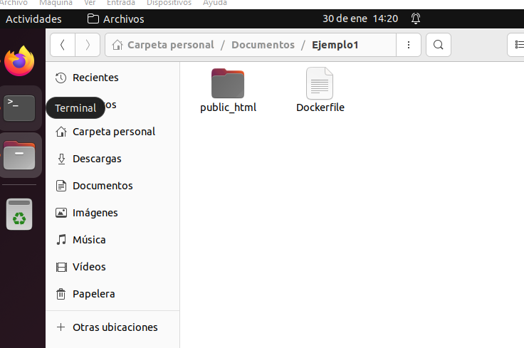
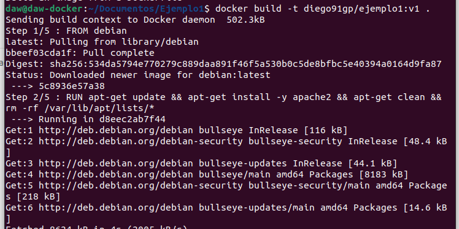

```bash
daw@daw-docker:~/Documentos/Ejemplo1$ docker images
REPOSITORY           TAG       IMAGE ID       CREATED         SIZE
diego91gp/ejemplo1   v1        deb6f1e7357c   4 seconds ago   235MB
nextcloud            latest    3539f97df93a   12 days ago     1.02GB
wordpress            latest    fcd4967b9728   2 weeks ago     615MB
```

